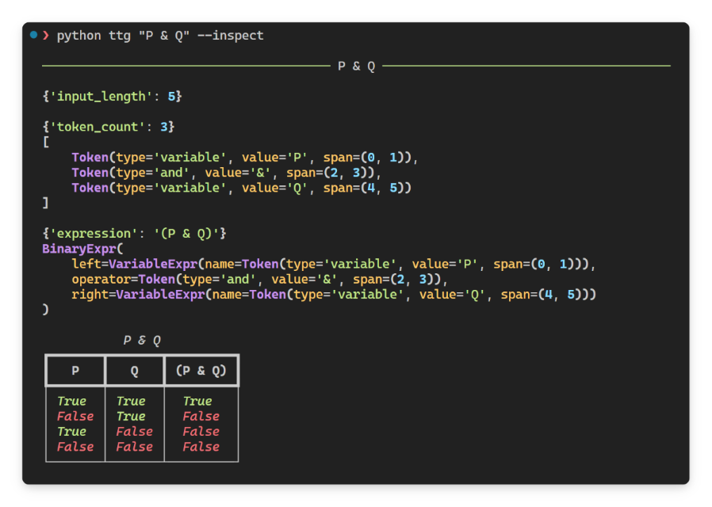
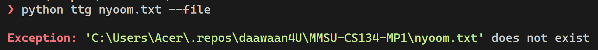
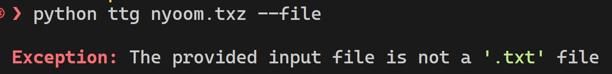
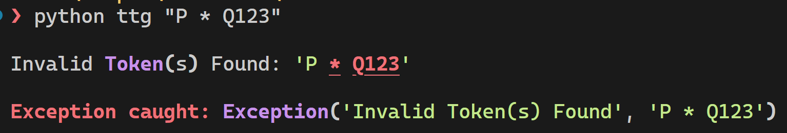
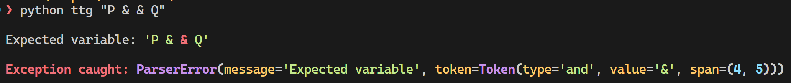

# 🟰 Truth Table Generator

A Truth Table Generator for Propositional Logic Formulas made with Python.

<div align="center">
	
</div>

## Features

- **Supported Logical Operators**: In order of precedence 
	- `NOT`, `not`, `!`, `~`, `¬`
	- `AND`, `and`, `&`, `&&`, `^`, `∧`
	- `OR`, `or`, `|`, `||`, `v`, `∨`
	- `THEN`, `then`, `IF`, `if`, `>`, `->`, `→`
	- `ONLY IF`, `only if`, `IFF`, `iff`, `==`, `<>`, `<->`, `↔`
- **Complex Formulas**: Input nested formulas using parenthesis `(...)` 
- **Unlimited Variables**: Add any amount of variables using any combination of alphabet `a-z,A-Z` letters.
- **Input using CLI or File**: Choose either the CLI or a file for input.

## Table of Contents

1. [Algorithm](#algorithm)
   - [Lexer](#lexer)
   - [Parser](#parser)
   - [Evaluator](#evaluator)
   - [Error Handling](#error-handling)
3. [User Manual](#algorithm)
   - [Running From Source](#running-from-source)
   - [Compiling From Source](#compiling-from-source)

## Algorithm

This Truth-Table Generator implements an interpreter divided into three components to handle different phases, namely:

1. **Lexer** for *tokenization* (converting `string` input to `List[Token]`) 
2. **Parser** for *Expression Tree* construction (constructing `Expr` tree from `List[Token]`)
3. **Evaluator** for the *Expression Tree* (evaluating `Expr` tree into a `List[bool]`)

### Lexer

The **Lexer** uses *Regex* with [*name-capturing-groups*](https://developer.mozilla.org/en-US/docs/Web/JavaScript/Reference/Regular_expressions/Named_capturing_group) to iteratively find and classify individual *matches* in the input string which are then converted into a list of *tokens*. This method allows performing the *tokenization* and *classification* phase entirely with *Regex* with minimal business logic (converting *Regex matches* to a custom `Token` class).

```
function tokenize(input_formula):
  tokens = empty list
  define regex patterns for each operator and variable

  for each match in input_formula:
    if match is "(": add "left_paren" token
    elif match is ")": add "right_paren" token
    elif match is NOT: add "not" token
    elif match is AND: add "and" token
    elif match is OR: add "or" token
    elif match is THEN: add "then" token
    elif match is ONLY IF: add "only_if" token
    elif match is variable: add "variable" token
    else: add "invalid" token

  return tokens
```

### Parser

The **Parser** is an implementation of a [*Recursive-Descent Parser*](https://en.wikipedia.org/wiki/Recursive_descent_parser) which validates the arrangement of the tokens with the expected grammar and simultaneously constructs an [*Expression Tree*](https://en.wikipedia.org/wiki/Binary_expression_tree) — wherein each *Node* represents its corresponding *token* and its related *Nodes*. It uses the following grammar described in a psuedo-format similar to [*Backus-Naur Form* (**BNF**)](https://en.wikipedia.org/wiki/Backus%E2%80%93Naur_form) and it utilizes the [*Precedence-Climbing Method*](https://en.wikipedia.org/wiki/Operator-precedence_parser) to implement operator precedence.

```
expr_primary = ( expr ) | variable
expr_not = expr_primary | NOT expr_not
expr_and = expr_not | expr_not AND expr_and
expr_or = expr_and | expr_and OR expr_or
expr_then = expr_or | expr_or THEN expr_then
expr_only_if = expr_then | expr_then ONLY_IF expr_only_if
expr = expr_only_if
```

```
function parse(tokens):
  return expr()

  function expr():
    return expr_only_if()

  function expr_only_if():
    left_expr = expr_then()
    while next token is ONLY IF:
      right_expr = expr_then()
      left_expr = new binary_expr(left_expr, "only_if", right_expr)
    return left_expr

  function expr_then():
    left_expr = expr_or()
    while next token is THEN:
      right_expr = expr_or()
      left_expr = new binary_expr(left_expr, "then", right_expr)
    return left_expr

  function expr_or():
    left_expr = expr_and()
    while next token is OR:
      right_expr = expr_and()
      left_expr = new binary_expr(left_expr, "or", right_expr)
    return left_expr

  function expr_and():
    left_expr = expr_not()
    while next token is AND:
      right_expr = expr_not()
      left_expr = new binary_expr(left_expr, "and", right_expr)
    return left_expr

  function expr_not():
    if next token is NOT:
      return new unary_expr("not", expr_not())
    return expr_primary()

  function expr_primary():
    if next token is "(":
      expression = expr()
      expect ")"
      return expression
    if next token is variable:
      return new variable_expr(token)
    throw error("Expected variable or expression")
```

### Evaluator

The **Evaluator** is simply a set of functions matched to each of the types of *Nodes* in the *Expression Tree*, namely `Variable` nodes, `Unary` nodes, and `Binary` nodes. Due to the nature of Tree Data Structures, evaluating the *Expression Tree* is as simple as recursively running each function in the *Expression Tree* for each *Node*.

A single evaluation will only return the results of each sub-expression in the Expression Tree based on the current set of truth-values used for each of the variables. In order to generate a truth-table, the Evaluator will generate the [*cartesian product*](https://en.wikipedia.org/wiki/Cartesian_product) of each of all the variables' possible states (**True** | **False**) then repeatedly evaluate the *Expression Tree* for each row of values. 

In simpler terms, the Evaluator will repeatedly evaluate the *Expression Tree* for each of all the possible combinations of **True** and **False** values for all the variables, in order to construct each row of the truth table.

```
function generate_truth_combinations(variables):
  combinations = empty list
  total_combinations = 2 ^ (count of variables)
  for each number from 0 to total_combinations - 1:
    create an empty dictionary called truth_values
    for each variable and index:
      value = get (index) bit digit of number
      set value for variable in truth_values dictionary
    add truth_values to combinations list
  return combinations

function evaluate(expression_tree, truth_values):
  if expression_tree is a variable:
    return truth_values[variable]
  
  if expression_tree is a unary expression:
    right_value = evaluate(right_expr, truth_values)
    if operator is "not":
      return NOT right_value
  
  if expression_tree is a binary expression:
    left_value = evaluate(left_expr, truth_values)
    right_value = evaluate(right_expr, truth_values)
    if operator is "and": return left_value AND right_value
    if operator is "or": return left_value OR right_value
    if operator is "then": return (NOT left_value) OR right_value
    if operator is "only_if": return left_value == right_value

function generate_truth_table(expression_tree, variables):
  combinations = generate_truth_combinations(variables)
  for each combination:
    evaluate the expression_tree with current truth values
  return truth table
```

### Error Handling

**Invalid File.** Upon running the program in `--file` mode, it will first check if the input filepath is valid (e.g. File exists, and File is a `.txt` File).





**Invalid Token.** The **Lexer** is a resilient tokenizer and will capture any group of unrecognizable characters as a `Token` of `"invalid"` type until the end of the input instead of terminating early. This allows the **Lexer** to display all the invalid tokens present in the input.



**Invalid Grammar.** The **Parser** while constructing the *Expression Tree* will immediately raise errors upon detecting any incorrect grammar and will inform the user on the expected supposed token in place of the current suspected token. Due to its complexity, the implementation is not resilient and will terminate upon encountering the first invalid grammar.



## User Manual

### Usage

Open a terminal on this project's root folder.

If you want to use the compiled binaries, simply run the executable file for your operating system from the `./bin` subfolder. Following is an example for Windows.

```sh
cd <this-project-folder>/bin

./ttg "P & Q" 
./ttg "P & Q" --inspect # Displays debug data
./ttg input.txt --file # Loads input from File
./ttg input.txt --file --inspect
```

> **WARNING:** Some Terminals have special meanings reserved for some symbols including but not limited to `!`, `$`, or `~`. Running the program in `--inspect` mode will allow you to see the raw input being parsed. In these cases, it is recommended to switch to other Terminals or switch to running the program in `--file` mode.

---

If you want to run it from source, *setup the project first by visiting section* `Running from Source` *for more information*. 

---

For more usage info, you can run `./ttg --help`.

```sh
> ./ttg --help
Usage: ttg [OPTIONS] INPUT

Options:
  -f, --file     Treats the input as a filepath.
  -i, --inspect  Display debug data.
  --help         Show this message and exit.
```

### Running from Source

**Recommended**: Install `Python 3.8` using a version manager such as `pyenv` from https://github.com/pyenv/pyenv/ (Unix) or https://github.com/pyenv-win/pyenv-win (Windows).

Alternatively, you can install python packages from https://www.python.org/downloads/.

**Recommended**: After setting up your python installation, install the project's dependencies in a virtual environment. Visit `venv` docs from https://docs.python.org/3/library/venv.html for more information:

```sh
cd <this-project-folder>

python -m venv .venv

# --- UNIX ---
source .venv/bin/activate # bash/zsh
.venv/Scripts/Activate.ps1 # Powershell

# --- Windows ---
source .venv/bin/Scripts/activate # bash/zsh
.venv\Scripts\activate.bat # Command Prompt
.venv\Scripts\Activate.ps1 # Powershell

pip install -r requirements.txt
```

Done! Simply run the project with the following:

```sh
python ttg "P & Q"
```

### Compiling from Source

In order to compile the project into a standalone executable, you will need `pyinstaller` from https://github.com/pyinstaller/pyinstaller (already included in `requirements.txt`). Visit the link for more information.

> **NOTE:** You can only compile to an executable format native to your current operating system (e.g. you can only create `.exe` files when compiling from Windows).

The following will build the project into a single-file standalone executable in the `./bin` folder.

```sh
pyinstaller ttg/__main__.py --onefile --clean --specpath "./bin/spec" --distpath "./bin" --workpath "./bin/build" --name "ttg"
```
